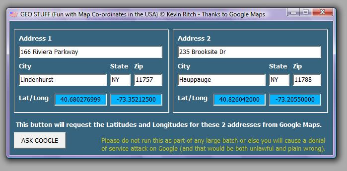



## Get Latitude and longitude GEO coordinates from Google Maps

### Description

If you need to calculate the distance between two addresses or search within an address database for proximity ranges, step one is to get the Latitude and Longitude coordinates for an address.

There are many places to get them, but I thought it would be neat to grab them off a Google Maps page after sending the address to Google.

This is NOT for MASS UPDATES for a database.

Indeed, there are easier, legal and quite cheap ways of doing that already.

But I thought that this would be a good bit of fun.

So enjoy!

Cheers,

Kevin Ritch

V8Software.com
 
### More Info
 

             |
---                |---
**Submitted On**   |2009-01-03 21:25:14
**By**             |[Kevin Ritch](https://github.com/Planet-Source-Code/PSCIndex/blob/master/ByAuthor/kevin-ritch.md)
**Level**          |Advanced
**User Rating**    |4.7 (14 globes from 3 users)
**Compatibility**  |VB 5\.0, VB 6\.0
**Category**       |[Complete Applications](https://github.com/Planet-Source-Code/PSCIndex/blob/master/ByCategory/complete-applications__1-27.md)
**World**          |[Visual Basic](https://github.com/Planet-Source-Code/PSCIndex/blob/master/ByWorld/visual-basic.md)
**Archive File**   |[Get\_Latitu213932132009\.zip](https://github.com/Planet-Source-Code/kevin-ritch-get-latitude-and-longitude-geo-coordinates-from-google-maps__1-71599/archive/master.zip)

